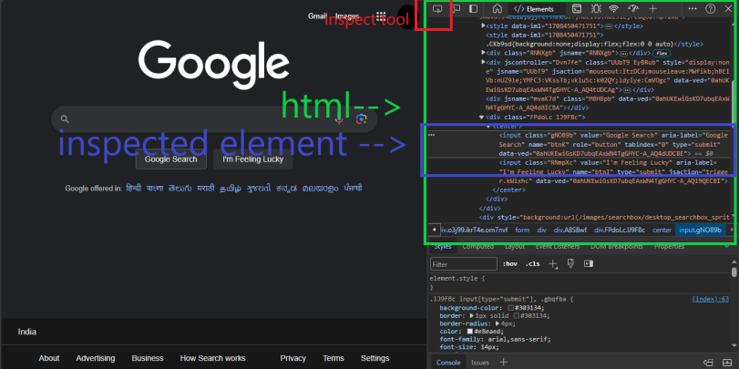

# HTML

HTML - Hyper Text Markup Language.

Used to create a web page.

Anthing displayed in a browser is a HTML element.

## DOM Stucture

A tree like logical structure used to represent a web page.

    <html>

        <head>
            <!---->
        </head>
        <body>
            <!---->
        </body>
    </html>

##

All web page is html file.
The two main section of html file is head and body.

`<head>` consist of page title and other meta tags.

`<body>` consist of all the visible content need to display in browser.

## Inspect the web element

To interact with webelement we need to find its locator.

In a browser we can access the element's locator by hoverover the element, mouse right click and click inspect option.


This will launch the html dev tool, where we can see the page html and highlight the inspected element.



You can use `inspect tool` to inspect as well.

* click the inspect tool

* click the element to inspect

* element's node will highlight

For element <input class="gNO89b" value="Google Search" aria-label="Google Search" name="btnK" role="button" tabindex="0" type="submit" data-ved="0ahUKEwiGsKD7ubqEAxWN4TgGHYC-A_AQ4dUDCBE"> , the element structure in html is

```html
<input class="gNO89b" value="Google Search" aria-label="Google Search" name="btnK" role="button" tabindex="0" type="submit" data-ved="0ahUKEwiGsKD7ubqEAxWN4TgGHYC-A_AQ4dUDCBE">
```

here,

    input is the tag name
    class is an attribute
    "gNO89b" is attribute value

Any word followed by `<` is tag name.
